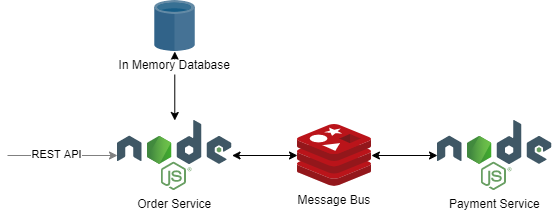

# Assignment



## Installation (Docker)
```bash
docker-compose up
```

## Installation (Manual)
1. Install Redis
1. Create `.env` file at the root directory of order-service and add
    ```bash
    REDIS_URL=redis://localhost:6379
    ```
1. Run order-service
    ```bash
    # install dependencies
    npm install
    
    # watch mode
    npm run start:dev
    
    # production mode
    npm run start:prod
    ```
1. Create `.env` file at the root directory of payment-service and add
    ```bash
    REDIS_URL=redis://localhost:6379
    ```
1. Run payment-service
    ```bash
    # install dependencies
    npm install
    
    # watch mode
    npm run start:dev
    
    # production mode
    npm run start:prod
    ```
    
## Swagger
Access Swagger UI at http://localhost:3000/api